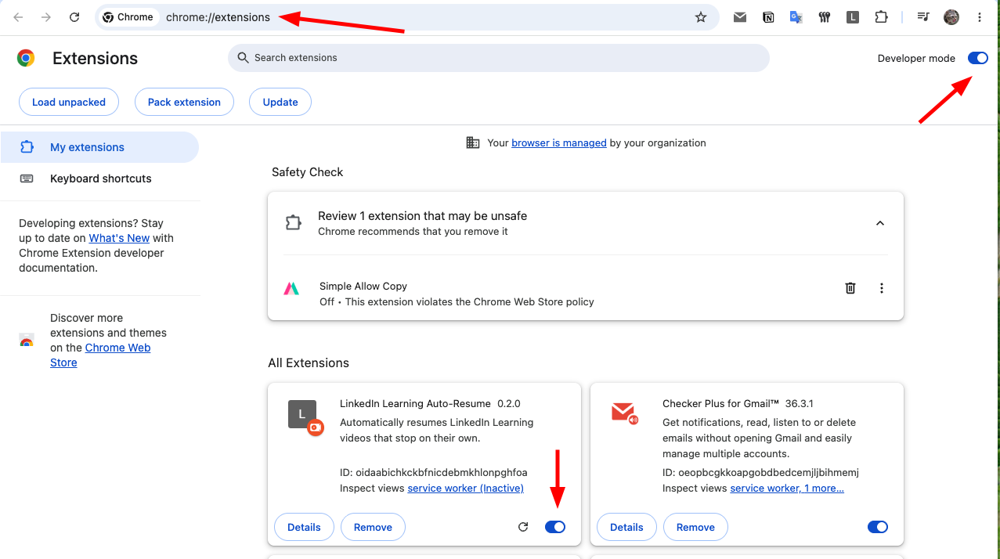

# Hướng dẫn cài đặt · Installation Guide

**[Tiếng Việt](#tiếng-việt) · [English](#english)**

Mất khoảng 2 phút. Không cần biết lập trình.
*Takes about 2 minutes. No coding needed.*

---

# Tiếng Việt

## Bạn cần gì

- Trình duyệt **Chrome** hoặc **Microsoft Edge** trên máy tính.
- Một tài khoản LinkedIn Learning.

Extension này không có trên Chrome Web Store nên cài thủ công. Nghe hơi lạ nhưng
chỉ là 4 bước bấm chuột.

## Bước 1 — Tải file về

Tải file zip tại đây:

**[dist/linkedin-learning-auto-resume-0.2.0.zip](dist/linkedin-learning-auto-resume-0.2.0.zip)**

Trên GitHub, bấm vào file rồi bấm nút **Download** (biểu tượng mũi tên xuống) ở
góc phải.

## Bước 2 — Giải nén

Bấm đúp vào file zip vừa tải. Bạn sẽ được một thư mục tên
`linkedin-learning-auto-resume-0.2.0`.

> **Quan trọng:** đặt thư mục này ở nơi cố định — ví dụ `Documents` hoặc
> `Applications`. **Đừng xoá hoặc di chuyển nó về sau.** Chrome đọc extension
> trực tiếp từ thư mục này mỗi lần khởi động; xoá đi là extension biến mất.
> Đừng để trong Downloads nếu bạn hay dọn thư mục đó.

## Bước 3 — Mở trang quản lý extension

Gõ vào thanh địa chỉ của Chrome:

    chrome://extensions

(Với Edge thì là `edge://extensions`.)

Bật công tắc **Developer mode** ở góc trên bên phải.

## Bước 4 — Nạp extension

Bấm **Load unpacked** ở góc trên bên trái, rồi chọn thư mục
`linkedin-learning-auto-resume-0.2.0` bạn vừa giải nén.

> Chọn đúng **thư mục**, không phải file zip, cũng không phải thư mục `src`
> bên trong. Thư mục đúng là thư mục có chứa file `manifest.json`.

Xong. Thẻ **LinkedIn Learning Auto-Resume** sẽ xuất hiện trong danh sách như
trong ảnh trên.

## Bước 5 — Ghim vào thanh công cụ

Bấm biểu tượng mảnh ghép 🧩 bên phải thanh địa chỉ, tìm
**LinkedIn Learning Auto-Resume**, bấm biểu tượng đinh ghim để nó luôn hiện.

Không ghim cũng chạy bình thường, chỉ là bạn sẽ phải vào mảnh ghép mỗi lần muốn
mở bảng điều khiển.

## Dùng thử

Mở một bài học bất kỳ tại `https://www.linkedin.com/learning/...` rồi bấm vào
biểu tượng extension.

Từ giờ khi video tự dừng giữa chừng, nó sẽ tự chạy tiếp. Có một dòng chữ nhỏ
hiện lên trên video mỗi lần như vậy.

Xem [README](README.md) để hiểu từng công tắc làm gì.

## Cập nhật lên bản mới

1. Tải file zip mới, giải nén.
2. **Thay thế** thư mục cũ bằng thư mục mới (giữ nguyên tên và vị trí).
3. Vào `chrome://extensions`, bấm nút 🔄 trên thẻ của extension.

Nếu bạn đang mở sẵn một bài học, tab đó sẽ tự tải lại — extension làm vậy để
trang không chạy code cũ.

## Gặp trục trặc?

**Biểu tượng extension mờ, bấm vào hiện "Hãy mở một bài học LinkedIn Learning".**
Extension chỉ hoạt động trên các trang bắt đầu bằng
`https://www.linkedin.com/learning/`. Mở một bài học rồi thử lại.

**Hiện "Trang đang chạy bản cũ của extension".**
Bấm F5 để tải lại trang.

**Bấm nút trong bảng điều khiển mà không thấy gì thay đổi.**
Tải lại trang LinkedIn (F5), rồi thử lại.

**Video không tự chạy lại, biểu tượng hiện dấu `!`.**
Chrome đang chặn tự động phát. Bấm chuột vào bất kỳ chỗ nào trên trang một lần
là xong.

**Chrome hiện cảnh báo "Tắt các extension ở chế độ nhà phát triển".**
Bình thường — Chrome nhắc thế với mọi extension cài thủ công. Bấm **Keep** hoặc
đóng thông báo. Đừng bấm nút tắt.

**Extension biến mất sau khi khởi động lại máy.**
Thư mục giải nén đã bị xoá hoặc di chuyển. Làm lại từ Bước 2, lần này để ở chỗ
cố định.

---

# English

## What you need

- **Chrome** or **Microsoft Edge** on a desktop computer.
- A LinkedIn Learning account.

This extension is not on the Chrome Web Store, so it installs by hand. That
sounds unusual but it is four clicks.

## Step 1 — Download

Get the zip here:

**[dist/linkedin-learning-auto-resume-0.2.0.zip](dist/linkedin-learning-auto-resume-0.2.0.zip)**

On GitHub, open the file and click the **Download** button (the downward arrow)
on the right.

## Step 2 — Unzip

Double-click the downloaded zip. You get a folder called
`linkedin-learning-auto-resume-0.2.0`.

> **Important:** put this folder somewhere permanent — `Documents` or
> `Applications`, say. **Do not delete or move it afterwards.** Chrome reads the
> extension from this folder every time it starts; delete the folder and the
> extension disappears. Avoid leaving it in Downloads if you clear that out.

## Step 3 — Open the extensions page

Type this into Chrome's address bar:

    chrome://extensions

(On Edge it is `edge://extensions`.)

Turn on **Developer mode**, top right.

## Step 4 — Load the extension

Click **Load unpacked**, top left, and pick the
`linkedin-learning-auto-resume-0.2.0` folder you just unzipped.

> Pick the **folder**, not the zip file, and not the `src` folder inside it. The
> right folder is the one containing `manifest.json`.

That is it. A **LinkedIn Learning Auto-Resume** card appears in the list, as in
the picture above.

## Step 5 — Pin it to the toolbar

Click the puzzle-piece icon 🧩 to the right of the address bar, find
**LinkedIn Learning Auto-Resume**, and click the pin so it stays visible.

It works fine unpinned; you would just have to open the puzzle menu each time you
want the panel.

## Try it

Open any lesson at `https://www.linkedin.com/learning/...` and click the
extension icon.

From now on, when a video stops on its own it starts again by itself. A small
note appears over the video each time.

See the [README](README.md) for what each switch does.

## Updating

1. Download the new zip and unzip it.
2. **Replace** the old folder with the new one, keeping the same name and place.
3. Go to `chrome://extensions` and click the 🔄 button on the extension's card.

If you have a lesson open, that tab reloads itself — the extension does this so
the page is not left running old code.

## Troubleshooting

**The icon is greyed out and says "Hãy mở một bài học LinkedIn Learning".**
The extension only works on pages starting with
`https://www.linkedin.com/learning/`. Open a lesson and try again.

**It says "Trang đang chạy bản cũ của extension".**
Press F5 to reload the page.

**A control in the panel does nothing.**
Reload the LinkedIn page (F5) and try again.

**The video does not restart and the icon shows `!`.**
Chrome is blocking autoplay. Click anywhere on the page once and it clears.

**Chrome warns about "Disable developer mode extensions".**
Normal — Chrome says this about every hand-installed extension. Click **Keep**
or dismiss it. Do not click the disable button.

**The extension vanishes after restarting the computer.**
The unzipped folder was deleted or moved. Redo from Step 2, this time somewhere
permanent.
