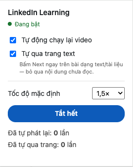

# LinkedIn Learning Auto-Resume

**[Tiếng Việt](#tiếng-việt) · [English](#english)**

LinkedIn Learning dừng video khi tưởng bạn không còn ở đó. Extension này bật lại.

*LinkedIn Learning stops the video when it thinks you have left. This puts it
back on.*

---

# Tiếng Việt

## Vấn đề

Bạn đang nghe một bài giảng trong lúc làm việc khác. LinkedIn không thấy bạn gõ
phím nên cho rằng bạn đã bỏ đi, và dừng video. Vài phút sau bạn nhận ra xung
quanh im lặng từ lúc nào, phải quay lại tìm chỗ đang nghe dở.

## Cách giải quyết

Extension trông chừng video. Khi nó dừng, extension bật lại — kèm một dòng chữ
nhỏ hiện lên báo cho bạn biết.

Nó cũng bấm hộ những hộp thoại kiểu "Bạn còn xem không?", chuyển sang bài tiếp
theo khi video hết, và giữ nguyên tốc độ phát bạn thích.

**Nó không làm phiền khi bạn không nhìn màn hình.** Khoá máy, chuyển sang tab
khác, thu nhỏ cửa sổ — extension nằm im. Chỉ khi bài học còn hiện trên màn hình
nó mới can thiệp. Trường hợp nó sinh ra để phục vụ là: bạn đang làm việc ở ứng
dụng khác, cửa sổ Chrome mất focus, nhưng tab bài học vẫn đang hiện.

## Cài đặt

Xem **[Hướng dẫn cài đặt](INSTALL.md)** — khoảng 2 phút, không cần biết lập
trình.

## Bảng điều khiển

Bấm vào biểu tượng extension khi đang mở một bài học.

| | |
|---|---|
| **Đang bật / Đang tắt** | Trạng thái hiện tại, chấm xanh là đang chạy. |
| **Tự động chạy lại video** | Công tắc chính. Bật sẵn. Bao gồm cả việc bấm hộ hộp thoại, chuyển bài khi hết video, và giữ tốc độ. |
| **Tự qua trang text** | *Tắt sẵn.* Xem mục dưới. |
| **Tốc độ mặc định** | Tốc độ tối thiểu cho mọi bài. |
| **Bật hết / Tắt hết** | Bật hoặc tắt cả hai công tắc bằng một nút. |

Mọi thiết lập được lưu lại. Bạn chỉnh một lần, không phải chỉnh lại — kể cả sau
khi tắt máy, và nó theo tài khoản Chrome sang máy khác.

### Muốn dừng video thật sự?

Tắt công tắc **Tự động chạy lại video**. Nếu không, extension sẽ bật lại mọi lần
dừng — nó không đoán được lần này bạn cố ý hay LinkedIn tự dừng.

### Tốc độ mặc định

Đây là **mức sàn**, không phải mức cố định. Mỗi bài mới sẽ chạy ít nhất ở tốc độ
này. Nếu bạn tăng nhanh hơn trên trang, extension để nguyên.

Đổi tốc độ bằng nút của LinkedIn cũng cập nhật luôn mặc định — hai chỗ chỉnh
cùng một giá trị. Chỉ có một ngoại lệ: trong **4 giây đầu** của một bài, thay
đổi sẽ không được ghi nhớ. Đó là lúc trình phát đang khởi động và tự đặt tốc độ
của nó; nếu ghi nhớ giai đoạn này thì lựa chọn của bạn sẽ bị nuốt mất. Chờ vài
giây rồi đổi, hoặc dùng bảng điều khiển.

### Tự qua trang text — cân nhắc trước khi bật

Một số bài không phải video mà là trang chữ hoặc tài liệu, phải bấm **Next** mới
đi tiếp. Bật công tắc này thì extension bấm hộ, ngay lập tức.

**Nghĩa là nó bỏ qua nội dung bạn chưa đọc.** Vì vậy nó tắt sẵn và tách riêng
khỏi công tắc chính.

Có chốt an toàn: quá 5 lần chuyển trang trong một phút thì nó tự dừng. Muốn chạy
tiếp thì tắt rồi bật lại công tắc.

## Câu hỏi thường gặp

**Extension có đọc được gì của tôi không?**
Nó chỉ chạy trên `linkedin.com/learning`. Không gửi dữ liệu đi đâu cả. Thiết lập
lưu trong bộ nhớ Chrome của bạn.

**Sao lại cần quyền "biết khi nào bạn rời máy tính"?**
Để biết máy đã khoá màn hình chưa. Khoá rồi thì extension ngừng can thiệp, không
phát tiếng vào phòng trống. Nó **không** dừng chỉ vì bạn ngồi im không gõ phím —
đó chính là tư thế của người đang nghe giảng.

**Nó tự trả lời câu hỏi cuối chương chứ?**
Không.

**Có chạy trên Safari / Firefox không?**
Không. Chrome và Edge thôi.

**Đang bấm mà không thấy phản ứng gì.**
Bấm F5 tải lại trang LinkedIn. Xem thêm mục xử lý sự cố trong
[Hướng dẫn cài đặt](INSTALL.md).

## Dành cho người phát triển

Kiến trúc, cách chạy test, cách sửa selector khi LinkedIn đổi giao diện: xem
[docs/DEVELOPMENT.md](docs/DEVELOPMENT.md).

---

# English

## The problem

You are listening to a lesson while doing something else. LinkedIn sees no
typing, decides you have left, and stops the video. A few minutes later you
notice the silence and have to go back and find your place.

## What this does

The extension watches the video. When it stops, the extension starts it again,
with a small note on screen so you know.

It also clicks through "Are you still watching?" dialogs, moves to the next
lesson when a video ends, and keeps your preferred playback speed.

**It stays out of the way when you are not looking.** Lock the screen, switch to
another tab, minimise the window — the extension does nothing. It only acts while
the lesson is actually on screen. The case it exists for is this one: you are
working in another app, the Chrome window has lost focus, but the lesson tab is
still the visible one.

## Install

See the **[Installation Guide](INSTALL.md)** — about 2 minutes, no coding needed.

## The panel

Click the extension icon while a lesson is open. The panel is in Vietnamese;
here is what each control means.

| | |
|---|---|
| **Đang bật / Đang tắt** | On / Off. A green dot means it is running. |
| **Tự động chạy lại video** | *Restart video automatically.* The main switch, on by default. Covers the dialogs, moving to the next lesson, and holding the speed. |
| **Tự qua trang text** | *Skip text pages automatically.* **Off by default** — see below. |
| **Tốc độ mặc định** | *Default speed.* The slowest any lesson will play. |
| **Bật hết / Tắt hết** | *All on / All off.* Flips both switches at once. |

Every setting is saved. Set it once and it stays — across restarts, and across
machines signed into the same Chrome account.

### Want the video to actually stay paused?

Turn off **Tự động chạy lại video**. Otherwise the extension restarts every
pause; it cannot tell your deliberate pause from LinkedIn's.

### Default speed

This is a *floor*, not a fixed value. Every new lesson plays at least this fast.
Set something faster on the page and the extension leaves it alone.

Changing speed with LinkedIn's own control also updates the default — the two
places edit one value. One exception: in the **first four seconds** of a lesson,
a change is not remembered. That is when the player is starting up and setting
its own speed, and remembering that would swallow your choice. Wait a moment, or
use the panel.

### Skip text pages — think before turning this on

Some lessons are text or documents rather than video, and only move on when you
click **Next**. With this switch on, the extension clicks it immediately.

**That means skipping past content you have not read.** Hence off by default, and
separate from the main switch.

There is a safety catch: more than 5 pages in a minute and it stops itself. Flip
the switch off and on to resume.

## Questions

**Can it read my data?**
It runs only on `linkedin.com/learning`. Nothing is sent anywhere. Settings live
in your own Chrome storage.

**Why does it want to "know when you are away from your computer"?**
To tell whether the screen is locked. Once it is, the extension stands down
rather than playing audio to an empty room. It does **not** stop just because you
are sitting still without typing — that is what watching a lesson looks like.

**Does it answer the end-of-chapter quizzes?**
No.

**Safari or Firefox?**
No. Chrome and Edge only.

**A control does nothing when I click it.**
Press F5 to reload the LinkedIn page. See the troubleshooting section of the
[Installation Guide](INSTALL.md).

## For developers

Architecture, tests, and how to fix the selectors when LinkedIn changes its
markup: [docs/DEVELOPMENT.md](docs/DEVELOPMENT.md).
